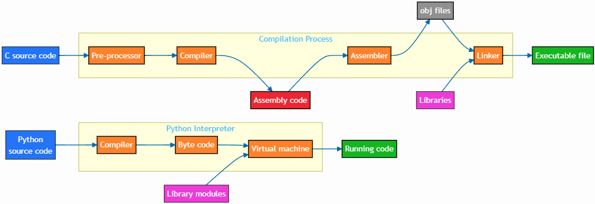

.. _boosting:

Performance Boosting
====================

.. objectives::

   - Learn how to boost performance using Numba and Cython

.. instructor-note::

   - 30 min teaching/type-along
   - 30 min exercises

Python: An interpreted language
-------------------------------

Python is an interpreted language, meaning the Python interpreter reads and executes your code line by line, directly translating it into actions without generating a separate executable file in advance.

   👍 **Pros:**
      - dynamic typing (no need to explicitly declare variable types)
      - rapid prototyping (no write, compile, execute cycle)
      - cross-platform (assuming interpreters exist for each platform)
      - automatic memory management (no need to preallocate or deallocate memory as Python uses ``reference counting`` and ``garbage collection`` to handle memory allocation)
   👎 **Cons:**
      - less secure and debuggable (code is exposed and vulnerable to modification or attack by malicious users or hackers)
      - slower execution (python interpreter translates source code line-by-line into intermediate code during runtime, which adds an extra layer of overhead and complexity)
      - resource-intensive (interpreted languages consume more memory and CPU power than compiled languages)

These pros and cons of Python come from the intrinsic interpretion of Python code compared with the compilation of C code.

Pre-compiling Python
--------------------

Pre-compiling Python refers to the process of converting Python source code (files with ``.py`` extension) into bytecode (files with ``.pyc`` extension) before execution.
Bytecode is an intermediate, platform-independent representation of your Python code that the Python interpreter can execute more quickly than raw source code.

`Cython <https://cython.org/>`_ and `Numba <https://numba.pydata.org/>`_ 
are among the popular choices and both of them have good support for NumPy arrays. 

Cython
------

Cython is a superset of Python that additionally supports calling C functions and  declaring C types on variables and class attributes.
Under Cython, source code gets translated into optimized C/C++ code and compiled as Python extension modules. 

Developers can run the ``cython`` command-line utility to produce a ``.c`` file from a ``.py`` file which needs to be compiled with a C compiler to an ``.so`` library which can then be directly imported in a Python program.
There is, however, also an easy way to use Cython directly from Jupyter notebooks through the ``%%cython`` magic command. Herein, we restrict the discussion to the Jupyter-way.
A full overview of Cython capabilities refers to the `documentation <https://cython.readthedocs.io/en/latest/>`_.

.. demo:: Demo: Cython

   Consider a problem to integrate a function:

   .. math:: 
       \int^{b}_{a}(x^2-x)dx

Python: Benchmarking (step 0)
^^^^^^^^^^^^^^^^^^^^^^^^^^^^^

Python code is provided below:

.. literalinclude:: example/integrate_python.py 

We generate a dataframe and apply the :meth:`apply_integrate_f` function on its columns, timing the execution:

.. code-block:: ipython

   import pandas as pd

   df = pd.DataFrame({"a": np.random.randn(1000),
		     "b": np.random.randn(1000),
		     "N": np.random.randint(100, 1000, (1000))})                

   %timeit apply_integrate_f(df['a'], df['b'], df['N'])
   # 194 ms ± 1.65 ms per loop (mean ± std. dev. of 7 runs, 1 loop each)

Cython: Benchmarking (step 1)
^^^^^^^^^^^^^^^^^^^^^^^^^^^^

In order to use Cython, we need to import the Cython extension:

.. code-block:: ipython

   %load_ext cython

As a first cythonization step, we add the cython magic command (``%%cython -a``) on top of Jupyter code cell.
We start by a simply compiling the Python code using Cython without any changes. The code is shown below:

.. literalinclude:: example/integrate_cython.py 

The yellow coloring in the output shows us the amount of pure Python code:

.. figure:: img/cython_annotate.png

Our task is to remove as much yellow as possible by *static typing*, *i.e.* explicitly declaring arguments, parameters, variables and functions.

We benchmark the Python code just using Cython, and it gives us about 10%-20% increase in performance. 

.. code-block:: ipython

   %timeit apply_integrate_f_cython(df['a'], df['b'], df['N'])
   # 141 ms ± 3.07 ms per loop (mean ± std. dev. of 7 runs, 1 loop each)

Cython: Adding data type annotation to input variables (step 2)
^^^^^^^^^^^^^^^^^^^^^^^^^^^^^^^^^^^^^^^^^^^^^^^^^^^^^^^^^^^^^^^

Now we can start adding data type annotation to the input variables as highlightbed in the code example below:

.. literalinclude:: example/integrate_cython_dtype0.py 
   :emphasize-lines: 6,9,16

.. code-block:: ipython

   # this will not work
   #%timeit apply_integrate_f_cython_dtype0(df['a'], df['b'], df['N'])
   
   # this command works (see the description below)
   %timeit apply_integrate_f_cython_dtype0(df['a'].to_numpy(), df['b'].to_numpy(), df['N'].to_numpy())
   # 64.1 ms ± 0.50 ms per loop (mean ± std. dev. of 7 runs, 10 loops each)

.. warning::

   You can not pass a Series directly since Cython definition is specific to an array. 
   Instead we should use ``Series.to_numpy()`` to get the underlying NumPy array which works nicely with Cython.

   .. note:: 

   Cython uses the normal C syntax for types and provides all standard ones, including pointers.
   Here is a list of a few examples:

      .. csv-table:: 
	 :widths: auto
	 :delim: ;

	 NumPy dtype;  Cython type identifier; C type identifier
	 import numpy as np; cimport numpy as cnp ;
	 np.bool_;      N/A ;             N/A
	 np.int_;       cnp.int_t;        long
	 np.intc;       N/A ;             int       
	 np.intp;       cnp.intp_t;       ssize_t
	 np.int8;       cnp.int8_t;       signed char
	 np.int16;      cnp.int16_t;      signed short
	 np.int32;      cnp.int32_t;      signed int
	 np.int64;      cnp.int64_t;      signed long long
	 np.uint8;      cnp.uint8_t;      unsigned char
	 np.uint16;     cnp.uint16_t;     unsigned short
	 np.uint32;     cnp.uint32_t;     unsigned int
	 np.uint64;     cnp.uint64_t;     unsigned long
	 np.float_;     cnp.float64_t;    double
	 np.float32;    cnp.float32_t;    float
	 np.float64;    cnp.float64_t;    double
	 np.complex_;   cnp.complex128_t; double complex
	 np.complex64;  cnp.complex64_t;  float complex
	 np.complex128; cnp.complex128_t; double complex

   Differeces between ``import`` (for Python) and ``cimport`` (for Cython) statements

      - ``import`` gives access to Python functions or attributes
      - ``cimport`` gives access to C functions or attributes 
      - it is common to use the following, and Cython will internally handle this ambiguity

      .. code-block:: ipython

         import numpy as np  # access to NumPy Python functions
         cimport numpy as np # access to NumPy C API

Cython: Adding data type annotation to functions (step 3)
^^^^^^^^^^^^^^^^^^^^^^^^^^^^^^^^^^^^^^^^^^^^^^^^^^^^^^^^^

Next step, we further add type annotation to functions. There are three ways of declaring functions: 

- ``def`` - Python style:

   - Called by Python or Cython code, and both input/output are Python objects.
   - Declaring argument types and local types (thus return values) can allow Cython to generate optimized code which speeds up the execution.
   - Once types are declared, a ``TypeError`` will be raised if the function is passed with the wrong types.

- ``cdef`` - C style:

   - Called from Cython and C, but not from Python code.
   - Cython treats functions as pure C functions, which can take any type of arguments, including non-Python types, `e.g.`, pointers.
   - This usually gives the best performance. 
   - However, one should really take care of the functions declared by ``cdef`` as these functions are actually writing in C.

- ``cpdef`` - C/Python mixed style:

   - ``cpdef`` function combines both ``cdef`` and ``def``.
   - Cython will generate a ``cdef`` function for C types and a ``def`` function for Python types.
   - In terms of performance, ``cpdef`` functions may be as fast as those using ``cdef`` and might be as slow as ``def`` declared functions.  

.. literalinclude:: example/integrate_cython_dtype1.py 
   :emphasize-lines: 6,9,16

.. code-block:: ipython

   %timeit apply_integrate_f_cython_dtype1(df['a'].to_numpy(), df['b'].to_numpy(), df['N'].to_numpy())
   # 54.9 ms ± 699 µs per loop (mean ± std. dev. of 7 runs, 10 loops each)

Cython: Adding data type annotation to local variables (step 4)
^^^^^^^^^^^^^^^^^^^^^^^^^^^^^^^^^^^^^^^^^^^^^^^^^^^^^^^^^^^^^^^

Last step, we can add type annotation to local variables within functions and the output.

.. literalinclude:: example/integrate_cython_dtype2.py 
   :emphasize-lines: 6,9,10,11,16,20,21

.. code-block:: ipython

   %timeit apply_integrate_f_cython_dtype2(df['a'].to_numpy(), df['b'].to_numpy(), df['N'].to_numpy())
   # 13.8 ms ± 97.8 µs per loop (mean ± std. dev. of 7 runs, 100 loops each)

Now it is ~ 100 times faster than the original Python implementation, and all we have done is to add type declarations on the Python code!
We indeed see much less Python interaction in the code from step 1 to step 4.

.. figure:: img/cython_annotate_2.png

Numba
-----

An alternative to statically compiling Cython code is to use a dynamic just-in-time (JIT) compiler with `Numba <https://numba.pydata.org/>`_. 
Numba allows to write a pure Python function which can be JIT compiled to native machine instructions, similar in performance to C/C++ and Fortran, by simply adding the decorator ``@jit`` in the function.

However, the ``@jit`` compilation will add overhead to the runtime of the function, *i.e.*, the first time a function is run using Numba engine will be slow as Numba will have the function compiled. 
Once the function is JIT compiled and cached, subsequent calls will be fast.
So the performance benefits may not be realized especially when using small datasets.

Numba supports compilation of Python to run on either CPU or GPU hardware, and is designed to integrate with Python scientific software stack.
The optimized machine code is generated by the LLVM compiler infrastructure.

.. demo:: Demo: Numba

   We consider the integration problem again using Numba.

   .. math:: 
       \int^{b}_{a}(x^2-x)dx

Numba: Adding ``@jit`` decorator for functions (step 1)
^^^^^^^^^^^^^^^^^^^^^^^^^^^^^^^^^^^^^^^^^^^^^^^^^^^^^^^

Here is the updated code with the inclusion of the ``@jit`` decorator for the three functions.

.. literalinclude:: example/integrate_numba.py 
   :emphasize-lines: 2,4,5,8,9,13,16,17,21

.. code-block:: ipython

   %timeit apply_integrate_f_numba(df['a'].to_numpy(), df['b'].to_numpy(), df['N'].to_numpy())
   # 474 µs ± 17 µs per loop (mean ± std. dev. of 7 runs, 1 loops each)

Numba: Adding date type to ``@jit`` decorator (step 2)
^^^^^^^^^^^^^^^^^^^^^^^^^^^^^^^^^^^^^^^^^^^^^^^^^^^^^^

We can further add date type, although in this case there is not much performance improvement:

.. literalinclude:: example/integrate_numba_dtype.py 
   :emphasize-lines: 4,8,16

.. code-block:: ipython

   %timeit apply_integrate_f_numba_dtype(df['a'].to_numpy(), df['b'].to_numpy(), df['N'].to_numpy())
   # 468 µs ± 298 ns per loop (mean ± std. dev. of 7 runs, 1,000 loops each)

.. callout:: Numba vs Cython

   Should you use Numba or Cython? Does it matter?

   - Performance is usually very similar and exact results depend on versions of Python, Cython, Numba and NumPy.
   - Numba is generally easier to use (just add ``@jit``).
   - Cython is more stable and mature, Numba developing faster.
   - Numba also works for GPUs (check optional material for `GPU Computing <https://enccs.github.io/hpda-python/GPU-computing/>`_).
   - Cython can compile arbitrary Python code and directly call C libraries, Numba has restrictions.
   - Numba requires LLVM toolchain, Cython only C compiler.
   
   Finally:

   - NumPy is really good at what it does.
   - For simple operations or small data, either Numba or Cython is not going to outperform it. But when things get more complex these frameworks can save the day!

Exercises
---------

.. exercise:: Profile the word-autocorrelation code

   - Revisit the `word-autocorrelation code <https://github.com/ENCCS/word-count-hpda.git>`_.
   - Clone the repository using the command below (You should add a **!** before each command if you use Jupyter to run the code example).

   .. code-block:: console

      $ git clone https://github.com/ENCCS/word-count-hpda.git
   
   To run the code, type:

   .. code-block:: console

      $ cd word-count-hpda
      $ python source/wordcount.py data/pg99.txt processed_data/pg99.dat
      $ python source/autocorrelation.py data/pg99.txt processed_data/pg99.dat results/acf_pg99.dat

   Add ``@profile`` to the :meth:`word_acf` function, and run ``kernprof``
   from the command line. What lines of this function are the most expensive?

   .. solution:: 

      .. code-block:: console

         $ kernprof -l -v source/autocorrelation.py data/pg99.txt processed_data/pg99.dat results/acf_pg99.dat 

      Output: 

      .. code-block:: text

         Wrote profile results to autocorrelation.py.lprof
         Timer unit: 1e-06 s
         
         Total time: 15.5976 s
         File: source/autocorrelation.py
         Function: word_acf at line 24
         
         Line #      Hits         Time  Per Hit   % Time  Line Contents
         ==============================================================
             24                                           @profile
             25                                           def word_acf(word, text, timesteps):
             26                                               """
             27                                               Calculate word-autocorrelation function for given word 
             28                                               in a text. Each word in the text corresponds to one "timestep".
             29                                               """
             30        10       1190.0    119.0      0.0      acf = np.zeros((timesteps,))
             31        10      15722.0   1572.2      0.1      mask = [w==word for w in text]
             32        10       6072.0    607.2      0.0      nwords_chosen = np.sum(mask)
             33        10         14.0      1.4      0.0      nwords_total = len(text)
             34      1010        658.0      0.7      0.0      for t in range(timesteps):
             35  11373500    4675124.0      0.4     30.0          for i in range(1,nwords_total-t):
             36  11372500   10897305.0      1.0     69.9              acf[t] += mask[i]*mask[i+t]
             37      1000       1542.0      1.5      0.0          acf[t] /= nwords_chosen      
             38        10         10.0      1.0      0.0      return acf
         

.. exercise:: Is the :meth:`word_acf` function efficient?

   Have another look at the :meth:`word_acf` function from the word-count project. 

   .. literalinclude:: exercise/autocorrelation.py
      :pyobject: word_acf
      
   Do you think there is any room for improvement? How would you go about optimizing 
   this function?

   Try to implement one faster version!

   .. solution:: Hints

      - You can replace the double loop (the manual calculation of an ACF) with an 
        in-built NumPy function, :meth:`np.correlate`. NumPy gurus often know which 
        function to use for which algorithms, but searching the internet also helps.
        One typically needs to figure out how to use the in-built function for the 
        particular use case.
      - There are two ways of using Numba, one with ``nopython=False`` and one with 
        ``nopython=True``. The latter needs a rewrite of the :meth:`word_acf` function 
        to accept the ``mask`` array, since Numba cannot pre-compile the expression 
        defining ``mask``.

   .. solution:: 

      The function uses a Python object (``mask``) inside a double for-loop, 
      which is guaranteed to be suboptimal. There are a number of ways to speed 
      it up. One is to use ``numba`` and just-in-time compilation, as we shall 
      see below. 

      Another is to find an in-built vectorized NumPy function which can calculate the 
      autocorrelation for us! Here are the Numpy and Numba ``(nopython=False)`` versions:

      .. tabs:: 
   
         .. tab:: NumPy

            .. literalinclude:: exercise/autocorrelation_numba_numpy.py
               :pyobject: word_acf_numpy

         .. tab:: Numba

            .. literalinclude:: exercise/autocorrelation_numba_numpy.py
               :pyobject: word_acf_numba_py

         In the `autocorr-numba-numpy branch <https://github.com/enccs/word-count-hpda/tree/autocorr-numba-numpy>`__ 
         of the word-count-hpda repository you 
         can additionally find a ``nopython=True`` Numba version as well as benchmarking 
         of all the versions. Note that the Numba functions use ``cache=True`` to save the 
         precompiled code so that subsequent executions of the ``autocorrelation.py`` script 
         are faster than the first.

.. exercise:: Pairwise distance

   Consider the following Python function:

   .. literalinclude:: example/dis_python.py

   Start by profiling it in Jupyter:

   .. code-block:: ipython

      X = np.random.random((1000, 3))
      %timeit dis_python(X)

   Now try to speed it up with NumPy (i.e. *vectorise* the function),
   Numba or Cython (depending on what you find most interesting).

   .. solution::

      .. tabs:: 
   
         .. tab:: NumPy
   
                .. literalinclude:: example/dis_numpy.py 

                .. code-block:: ipython

                   X = np.random.random((1000, 3))
                   %timeit dis_numpy(X)

   
         .. tab:: Cython
   
                .. literalinclude:: example/dis_cython.py 

                .. code-block:: ipython

                   X = np.random.random((1000, 3))
                   %timeit dis_cython(X)

                We can further improve performance by using more C functions: 

                .. literalinclude:: example/dis_cython_v1.py 

                .. code-block:: ipython

                   X = np.random.random((1000, 3))
                   %timeit dis_cython_v1(X)

   
         .. tab:: Numba
   
                .. literalinclude:: example/dis_numba.py 

                .. code-block:: ipython

                   X = np.random.random((1000, 3))
                   %timeit dis_numba(X)

         .. tab:: SciPy
   
                .. code-block:: ipython

                   from scipy.spatial.distance import cdist
                   X = np.random.random((1000, 3))
                   %timeit cdist(X, X)

.. exercise:: Bubble sort

   To make a long story short, in the worse case the time taken by the Bubblesort algorithm is 
   roughly :math:`O(n^2)` where  :math:`n` is the number of items being sorted. 

   .. image:: img/Bubble-sort-example-300px.gif

   Here is a function that performs bubble-sort:

   .. literalinclude:: example/bs_python.py 

   And this is how you can benchmark it:

   .. code-block:: ipython

      import random
      l = [random.randint(1,1000) for num in range(1, 1000)]
      %timeit bs_python(l)

   Now try to speed it up with Numba or Cython (depending on what you find 
   most interesting). Make sure that you're getting the correct result, 
   and then benchmark it with ``%timeit``.

   .. solution:: 
   
      .. tabs:: 

         .. tab:: Cython

                .. literalinclude:: example/bs_cython.py 

                .. code-block:: ipython

                   import random
                   import numpy as np
                   l = [random.randint(1,1000) for num in range(1, 1000)]
                   l_arr = np.asarray(l)
                   %timeit bs_cython(l_arr)

             
                We can further improve performance by using more C/C++ features: 

                .. literalinclude:: example/bs_cython_adv.py 

                .. code-block:: ipython

                   import random
                   l = [random.randint(1,1000) for num in range(1, 1000)]
                   %timeit bs_clist(l)

         .. tab:: Numba

                .. literalinclude:: example/bs_numba.py 

                .. code-block:: ipython

                   import random
                   import numpy as np
                   l = [random.randint(1,1000) for num in range(1, 1000)]
                   # first try using a list as input
                   %timeit bs_numba(l)
                   # try using a NumPy array
                   l = [random.randint(1,1000) for num in range(1, 1000)]
                   l_arr = np.asarray(l)
                   %timeit bs_numba(l_arr)

.. exercise:: Static typing

   Consider the following example of calculating the square of an array.
   We have a few different versions using Numba. Benchmark them and compare the results.

      .. tabs:: 

         .. tab:: NumPy
   
                .. code-block:: ipython

                   import numpy as np
                   X=np.random.rand(10000)
                   %timeit np.square(X) 

   
         .. tab:: Numba without static typing
   
                .. literalinclude:: example/nb_no_typing.py 

                .. code-block:: ipython

                   X=np.random.rand(10000)
                   %timeit nb_no_typing(X)
   
         .. tab:: Numba with static typing
   
                .. literalinclude:: example/nb_typing.py 

                .. code-block:: ipython

                   X=np.random.rand(10000)
                   %timeit nb_typing(X)

         .. tab:: Numba with static typing and vectorization
   
                .. literalinclude:: example/nb_typing_vec.py 

                .. code-block:: ipython

                   X=np.random.rand(10000)
                   %timeit nb_typing_vec(X)

   .. solution:: Typing is not a necessity

      None of the Numba version will outperform the NumPy version for this simple and small example.

      You will see that using static typing actually leads to a decreased performance, since the 
      input array is not assumed to be continuous and therefore ruling out the vectorization.
      By defining the array as continuous, the performace can be recovered.

      In principle, such cases where typing does not allow optimizations could happen to Cython codes as well, 
      so one should always optimize where and when needed. 

See also
--------

- `Precompiling
  <https://rules-python.readthedocs.io/en/0.35.0/precompiling.html>`_
- `Cython and Numba <https://neurohackweek.github.io/cython-tutorial/>`_

.. keypoints::

   - To squeeze the last drop of performance out of your Python code, you can 
     convert performance-critical functions to Cython or Numba.
   - Both Cython and Numba pre-compile Python code to make it run faster.
